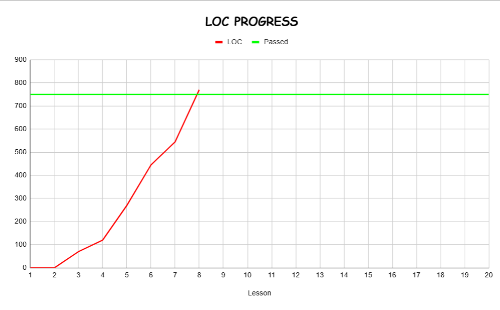

# LAB211

---
**Instructor: ThangPD10 - FPT University**

---
## Progress
| Exercise | Description | LOC |
| :-- | :--- | :--- |
|[J1.S.P0065](J1.S.P0065) |Find average mark and classification student |70 |
|[J1.S.P0009](J1.S.P0009) |Fibonacci |50 |
|[J1.S.P0071](J1.S.P0071) |Task management program (module extract from CCRM project) |150 |
|[J1.S.P0021](J1.S.P0021) |Create a Java console program to manage Student |175 |
|[J1.S.P0074](J1.S.P0074) |Write a calculator program (from DCPS's project) |100 |
|[J1.S.P0022](J1.S.P0022) |Create a Java console program to manage Candidate |175 |

## Graph

